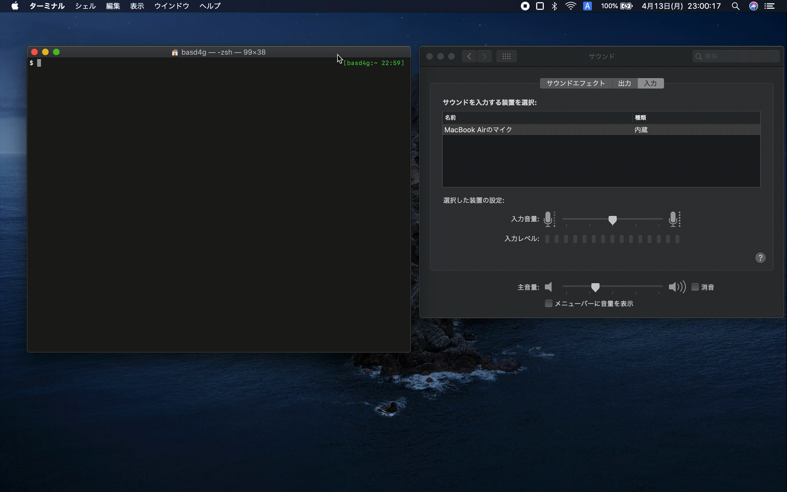
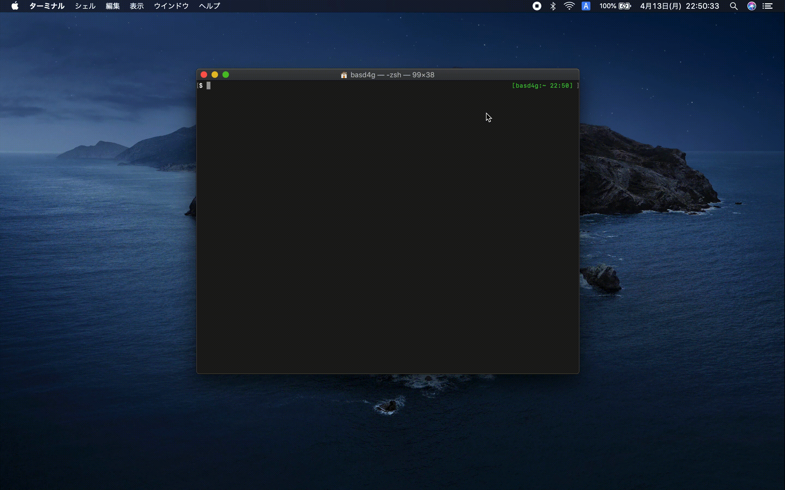

研究室や就職先などでのコンピュータのセットアップのために、3月頃から[dotfiles](https://github.com/basd4g/dotfiles)を構築している。

その流れでdefaultsコマンドを知ったので、その記録と使い方、調べ方を残しておく。。

## defaultsコマンドとは

macOSにおける環境設定や各アプリケーションの設定は.plist拡張子の[プロパティリスト](https://developer.apple.com/library/archive/documentation/General/Reference/InfoPlistKeyReference/Articles/AboutInformationPropertyListFiles.html)と言われるファイルに記録される。
このプロパティリストを読み書きするためにmacOSに標準で搭載されているのがdefaultsコマンドである。
(詳細は`$ man defaults`してください。)

これを利用して、OS全体の環境設定やアプリケーションの設定を自動化するスクリプトをつくっている。([実際に作ったスクリプト - basd4g/dotfiles - GitHub](https://github.com/basd4g/dotfiles/blob/master/bin/macos-defaults.sh))

今回はこのスクリプトを構築するための話。

参考: [Macの「ターミナル」でプロパティリストを編集する - ターミナルユーザガイド - Apple](https://support.apple.com/ja-jp/guide/terminal/apda49a1bb2-577e-4721-8f25-ffc0836f6997/mac)

## 他人の設定を拝借する

ネット上に他の人がどのコマンドを叩くとどの設定が変更できるかを調べてすでにまとめてくれたものがある。これを拝借するのが第一の手。

公式でどこかに情報がまとまっていればよいのだが、「公式な」設定変更のやり方はGUIから変えることだからか、そんな丁寧なマニュアルはなさそう。

- [MacOS defaults コマンドをマスターする - Think Abstract](https://amasuda.xyz/post/2016-10-23-mastering-mac-defaults-command/)
- [MacOS で設定する defaults コマンドをまとめてみた - Corredor](https://neos21.hatenablog.com/entry/2019/01/10/080000)
- [ターミナルから Mac を設定する（defaults write コマンド等） - Qiita](https://qiita.com/djmonta/items/17531dde1e82d9786816)
- [iMac/MacBook購入後に必ず設定したい設定項目 - Qiita](https://qiita.com/ryuichi1208/items/5905240f3bfce793b33d)
- [Macbook Pro 2018 で手動で行った初期設定と、defaults コマンドを使った設定のメモ - Just another oki2a24 ブロゴ](https://oki2a24.com/2019/01/21/nitial-setting-done-manually-and-setting-with-defaults-command-on-macbook-pro-2018/)
- [システム環境設定をターミナル（defaultsコマンド）から設定する方法（一般） - OTTAN.XYZ](https://ottan.xyz/system-preferences-terminal-defaults-2-4643/)
- [OSXのコマンドラインからすると捗った設定リスト - will and way](https://matsuokah.hateblo.jp/entry/2016/01/01/161753)
- [macOS Mojaveを高速化する 20の効果的な設定、Macを買ったら最初に設定する俺チューン設定項目 - FREE WINGの Androidと Windows、中国語の便利ソフト](http://www.neko.ne.jp/~freewing/software/macos_mojave_speed_up_setting_tips/)
- [Tips of Rubbish DIYとIoTをこよなく愛する、WEB関連やデジモノなどの雑多な情報ブログ](http://wordpress.ideacompo.com/?p=4826)

_注釈: defaultsコマンドを実行すると、設定変更が即座に反映されるわけではない。以下のように再起動するなどして設定を読み込ませると良い。_

```sh
# Dockの設定変更を反映
$ killall Dock
# finderの設定変更を反映
$ killall Finder
# メニューバー(画面上部)の設定変更を反映
$ killall SystemUIServer
# その他駄目なら再起動。
$ sudo reboot
```

## 設定するコマンドを探す

ネットを探していても自分の思うような設定がみつからないことがある。そのときは以下の手順で調べると見つかるかもしれない。

### defaultsコマンドの使い方

前提として、manual(`$ man defaults`)の通り、defaultsコマンドは次のように使う。
以下は簡略に示す。実際に実行する際はmanualを参照。

```sh
# すべて読む
$ defaults read

# 読む
$ defaults read DOMAIN KEY
$ defaults read -g KEY
# 書き込む
$ defaults write DOMAIN KEY VALUE
$ defaults write -g KEY VALUE
```

プロパティリストはkeyとvalueの対が原則で、jsonのようにvalueの中に入れ子でkeyとvalueのまとまりなどが入る。

valueにはstringやdata, int, float, bool, array, dictなどの形式がある。

`$defaults write`する際にオプションで`-string`や`-array`, `-array-add`とすると希望のデータ型で値を書き込める。

### 探し方

設定変更前後のプロパティリストの差分から、それっぽい設定項目を見つける。
その後実際に`$ defaults write`でプロパティリストを書き換えて、設定が反映されるかを確認する。

このとき、設定変更のためのGUIウィンドウは予め開いておいて、beforeとafterの記録をすると良い。
プロパティリストには我々が手動で設定した環境設定の他にも多用途に利用されているらしく、時間をあけるとあっという間にdiffが汚くなる。

```sh
$ defaults read > before

# GUI上で設定を変更する

$ defaults read > after
$ diff before after
# colordiff(brew install colordiff)などを使うと捗る
```

### 実際に探す一例

一例として、メニューバーに音量アイコンを表示する設定を探す。

#### プロパティリストを読む

GUIで設定する前後のプロパティリストを比較する。



```sh
$ defaults read > before
# GUIで設定変更
$ defaults read > after
$ diff before after
6504a6505
>         "NSStatusItem Visible com.apple.menuextra.volume" = 1;
6511c6512,6513
<             "/System/Library/CoreServices/Menu Extras/Bluetooth.menu"
---
>             "/System/Library/CoreServices/Menu Extras/Bluetooth.menu",
>             "/System/Library/CoreServices/Menu Extras/Volume.menu"
```

差分を見ると、6500行目あたりに設定項目がありそう。

実際にafterの6500行目以降の数行を見てみる。

```after
     "com.apple.systemuiserver" =     {
         "NSStatusItem Visible com.apple.menuextra.airport" = 1;
         "NSStatusItem Visible com.apple.menuextra.battery" = 1;
         "NSStatusItem Visible com.apple.menuextra.bluetooth" = 1;
         "NSStatusItem Visible com.apple.menuextra.clock" = 1;
         "NSStatusItem Visible com.apple.menuextra.volume" = 1;
         "__NSEnableTSMDocumentWindowLevel" = 1;
         "last-analytics-stamp" = "608273612.570469";
         menuExtras =         (
             "/System/Library/CoreServices/Menu Extras/Clock.menu",
             "/System/Library/CoreServices/Menu Extras/Battery.menu",
             "/System/Library/CoreServices/Menu Extras/AirPort.menu",
             "/System/Library/CoreServices/Menu Extras/Bluetooth.menu",
             "/System/Library/CoreServices/Menu Extras/Volume.menu"
         );
     };
```


以上より、設定は次の内容を書き込めば良さそう。

- ドメイン `com.apple.systemuiserver` 、キー `NSStatusItem Visible com.apple.menuextra.volume` に、値 `1` を設定する。
- ドメイン `com.apple.systemuiserver` 、キー `menuExtra` の値の配列に、
`/System/Library/CoreServices/Menu Extras/Volume.menu` を追加。

シェルスクリプトにまとめると次の通り。

```bash
#!/bin/bash -e

# 音量アイコンをMenuBarに表示
defaults write com.apple.systemuiserver \
  "NSStatusItem Visible com.apple.menuextra.volume" 1

defaults write com.apple.systemuiserver \
  menuExtras -array-add "/System/Library/CoreServices/Menu Extras/Volume.menu"

# メニューバーを再起動
killall SystemUIServer
```

#### プロパティリストに書き込んで試す

実際に試してみると、反映されていることがわかる。



## なぜdefaultsコマンドを使うのか

### メリット

- 設定を自動化できる

PCで新しく環境構築する際に、シェルスクリプトにまとまっているので一括で設定できる

- 自分が行っていた設定を記録できる。

自分がGUI上でどんな設定を行っているか、いたかをコードで示すことができる。
アプリケーションがプロパティリストとしてデータを持っているならば、サードパーティアプリケーションでも同様に設定を記録できる。

たとえば、私は[ShiftIt](https://github.com/fikovnik/ShiftIt)というアプリケーションを使っている。
このアプリケーションで使うキーバインドはGUI上から設定するのだが、自分がどんな設定をしているのかをコードとして記録できるのは、再設定だけでなく今後のなんらかのキーバインド設定の参考にもなる。

参考: [私の現在のShiftItのキーバインド設定](https://github.com/basd4g/dotfiles/blob/master/bin/shiftit-init.sh)

### デメリット

- 設定変更のたびに逐一調べてシェルスクリプトを更新しなければならない

これはたしかに面倒だけどね。
プロパティリストをむやみに書き換えると、パソコンが上手く動かなくなる可能性もある。。

- OSのアップデートによって設定が適用できなくなるかもしれない

GUIもアップデートで項目がなくなったりどこにいったかわからなくなったりするよね

## まとめ

以下を使って頑張ってシェルスクリプトを書こう。

```sh
$ defaults read > before
# GUIで設定変更
$ defaults read > after
$ diff before after

$ man defaults
```

## 将来の自分へ

diffを読み取ってdefaultsコマンドのシェルスクリプト形式にするのは自動化できるのでは？
と思ったが、[先駆者がいたようだ](https://rcmdnk.com/blog/2015/03/22/computer-mac/)

